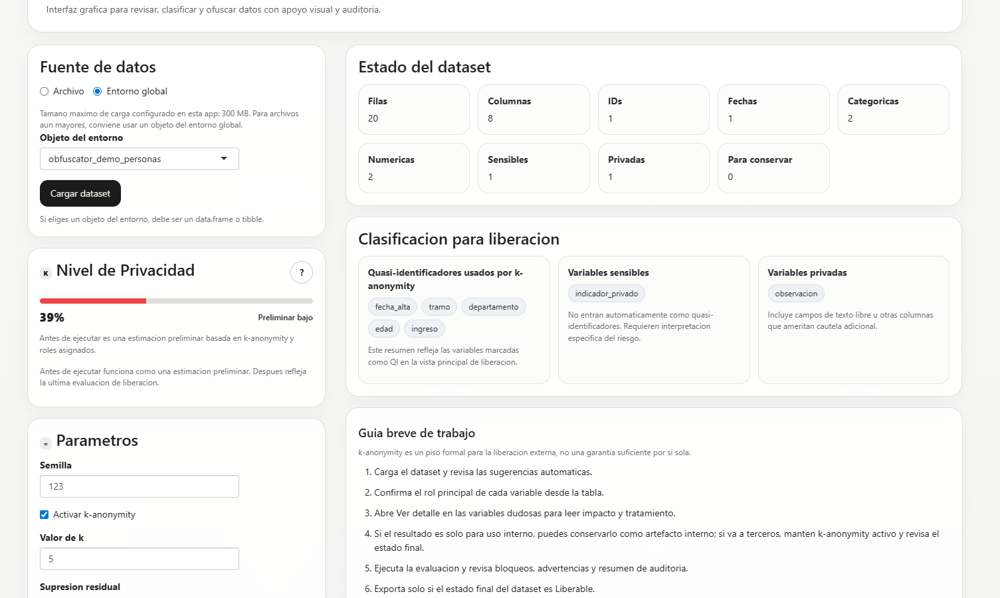
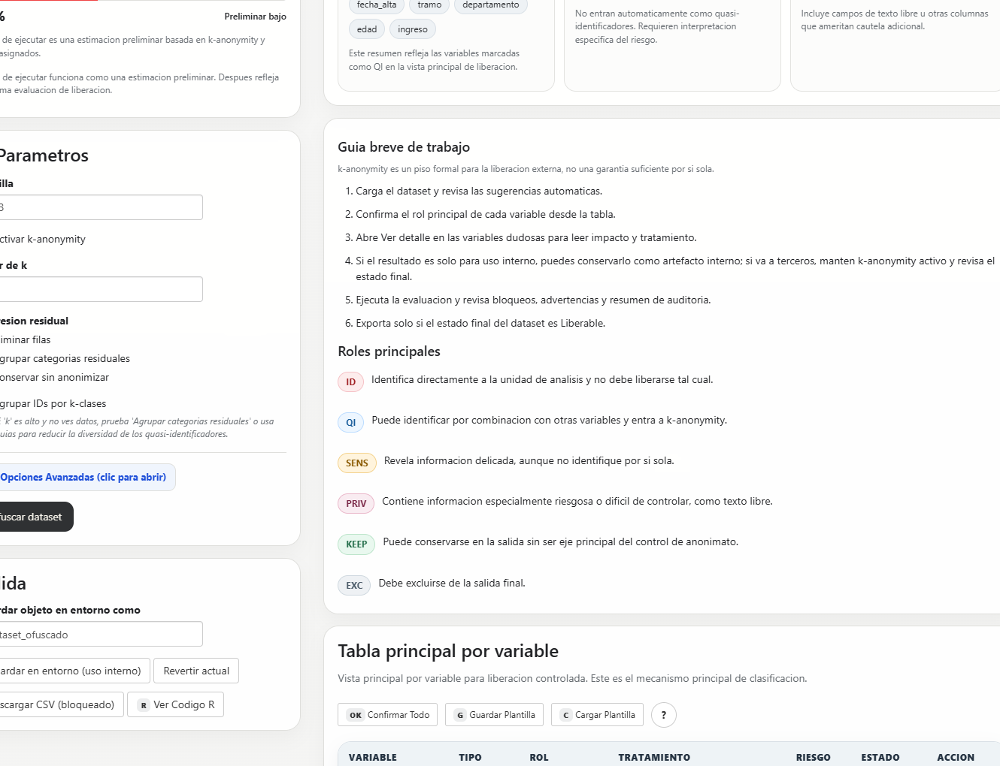
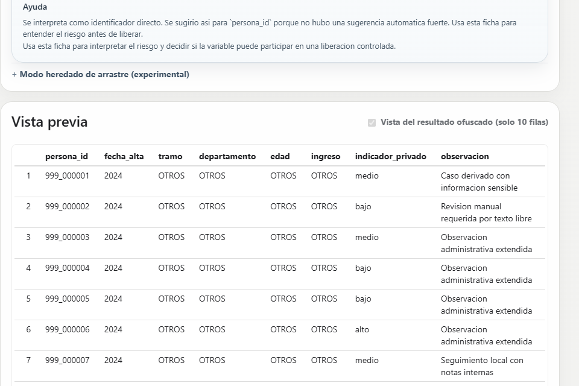
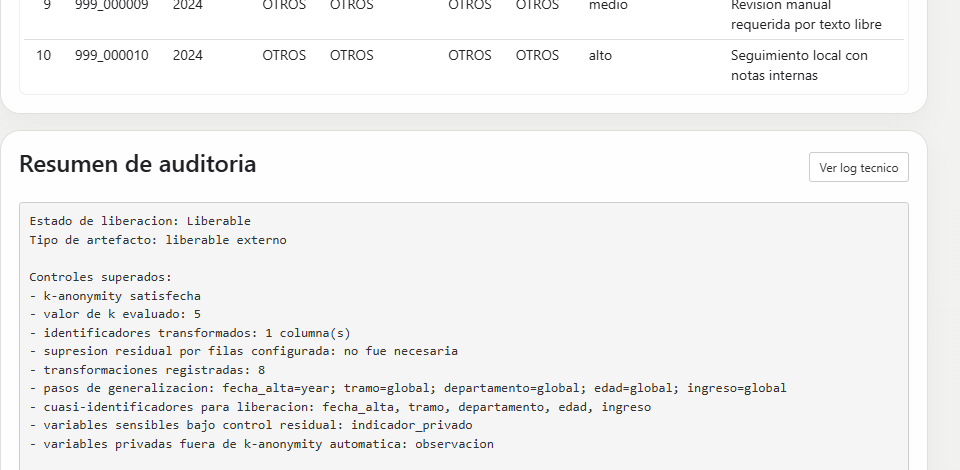
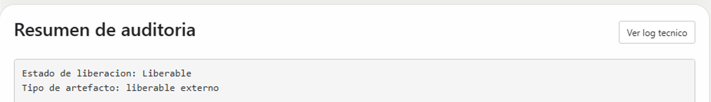

## Una necesidad muy concreta

- En la institución ya usamos IA o estamos cerca de usarla más.
- La IA es útil cuando recibe mejor contexto.
- Pero dar contexto con datos reales no es inocuo.
- El problema no es solo "ofuscar": es decidir **qué puede salir**, **qué no**, y **por qué**.

> Idea central: si la institución quiere usar mejor herramientas como Copilot, necesita una forma más disciplinada de preparar datos.

::: notes
Lo primero que quiero mostrar no es la interfaz, sino el problema.

Hoy herramientas como Copilot pueden ser útiles para redactar, resumir, programar o pensar consultas, pero su utilidad mejora mucho cuando se les puede dar contexto real. El problema es que, en organismos con obligaciones de reserva, no podemos pasar de datos reales a consultas con IA de forma improvisada.

Entonces la pregunta no es solamente cómo saco nombres o documentos. La pregunta es más seria: cómo construyo una decisión defendible sobre qué puede compartirse con un tercero, incluyendo a la IA, y qué no debería salir.

ObfuscatoR nace para responder a esa pregunta. No como una promesa de anonimización perfecta, sino como una herramienta de liberación controlada.
:::

## Qué quise construir

- Una herramienta local en R/Shiny.
- Pensada para preparar datasets antes de compartirlos con terceros.
- Considera a la IA como un tercero más, no como una excepción permisiva.
- Si no puede defender la salida, **bloquea** y explica por qué.

**Importante:** no es una iniciativa institucional formal.  
Es un MVP construido en mi tiempo libre y en mi computadora, pensado para elevarlo más adelante a consideración técnica si la organización madura su marco de uso de IA.

::: notes
Acá hago una aclaración que para mí es importante ética e institucionalmente.

Esto no es una herramienta oficialmente impulsada por la institución. Es una iniciativa propia, hecha como prototipo funcional en mi tiempo libre, con la idea de explorar si este problema podía traducirse en una solución útil.

Lo importante es que no la presento como producto terminado ni como algo ya adoptado, sino como un MVP que puede servir para discutir una necesidad real: cómo usar mejor la IA sin perder disciplina en protección de datos.
:::

## Por qué esto encaja con CRISP-DM

::: columns
::: {.column width="55%"}
- **Comprensión del problema:** uso de IA con datos institucionales bajo obligaciones de reserva.
- **Comprensión de datos:** no alcanza con sacar identificadores directos.
- **Preparación de datos:** clasificación de variables, transformación, generalización y exclusión.
- **Evaluación:** no solo "funciona", también "¿es defendible liberar esto?".
- **Despliegue potencial:** solo después de aclarar límites, riesgos y gobernanza.
:::
::: {.column width="45%"}
> La especificación de requerimientos fue tratada como un artefacto vivo.

Cambió a medida que:

- aparecieron casos de borde;
- se hicieron investigaciones normativas;
- se hicieron pruebas manuales;
- y se revisó la UI/UX para hacer la herramienta más usable.
:::
:::

::: notes
Acá está el puente con la metodología del curso.

No quise construir primero una app y después inventarle una justificación. Intenté recorrer algo muy parecido a CRISP-DM: entender el problema, entender qué riesgos hay realmente en los datos, preparar y transformar, evaluar no solo el resultado técnico sino su defendibilidad, y recién después pensar en uso institucional.

La idea de especificación viva para mí no significa inestabilidad. Significa que, cuando investigas mejor, pruebas más y encuentras nuevos casos, refinas el artefacto de requerimientos en vez de fingir que el primer documento ya era perfecto.

Ese es, para mí, el aprendizaje más valioso: una buena solución empieza mucho antes de la interfaz.
:::

## Marco normativo y estratégico en Uruguay

- **Ley Nº 18.331**: protección de datos personales y habeas data.
- **Decreto Nº 414/009**: reglamentación de la ley y reglas sobre tratamiento y comunicación de datos.
- **Decreto Nº 308/014**: ajustes sobre la reglamentación.
- **AGESIC - Estrategia de IA para el Gobierno Digital**: uso responsable de IA en la Administración Pública.

**Traducción práctica al producto:**

- la IA se trata como tercero;
- no basta con "sacar nombres";
- debe haber criterios de bloqueo, advertencia y trazabilidad.

::: notes
Acá no quiero dar una clase de derecho, pero sí marcar que el diseño no sale del aire.

El marco normativo uruguayo sobre protección de datos personales obliga a tratar seriamente la comunicación de datos a terceros. Y si la IA es un tercero en términos prácticos, no tiene sentido diseñar una herramienta como si esa frontera no existiera.

Además, el trabajo de AGESIC sobre estrategia de IA para gobierno digital refuerza la idea de uso responsable, seguro y confiable. Entonces el producto traduce eso a reglas concretas: advertir, bloquear, diferenciar uso interno de liberación externa y dejar trazabilidad.
:::

## De la metodología a requerimientos concretos

- Diferenciar `ID`, `QI`, `SENS`, `PRIV`, `KEEP`, `EXC`.
- Tratar `k-anonymity` como **piso formal**, no como garantía suficiente por sí sola.
- Bloquear exportación externa salvo estado `Liberable`.
- Dejar resumen de auditoría y log técnico.
- Separar:
  - artefacto interno,
  - liberación controlada,
  - revisión manual,
  - bloqueo.

::: notes
Esta es la parte donde la ingeniería de requerimientos deja de ser abstracta.

No alcanza con decir "hay que anonimizar". Hay que decidir qué roles existen, qué hace el sistema con cada uno, cuándo aplica k-anonymity, cuándo no, cuándo avisa, cuándo bloquea, y qué evidencia deja.

Ese pasaje de un problema difuso a reglas concretas es, en sí mismo, parte del valor del trabajo. Incluso aunque el MVP todavía tenga límites, ya ordena una discusión que muchas veces en la práctica queda implícita.
:::

## Estado actual del MVP {.focus-slide}

{fig-alt="Vista principal del MVP con obfuscator_demo_personas cargado, medidor, resumen de clasificación y roles visibles" width="100%"}

::: {.focus-caption}
Dataset cargado, lectura inicial del esquema y criterios de liberación visibles desde el primer paso.
:::

::: notes
Esta es la pantalla principal actual del MVP.

Lo importante no es memorizar cada control, sino ver la lógica: se carga un dataset, el sistema propone una lectura inicial del riesgo, organiza la clasificación por variable y hace visible desde temprano que estamos en un flujo de liberación controlada, no simplemente de transformación cosmética.

Para la demo elegí un dataset de ejemplo más expresivo: `obfuscator_demo_personas`. Se ve enseguida un identificador directo, variables cuasi-identificadoras, una variable sensible y texto libre. Eso ayuda a que la lógica del sistema se entienda mucho mejor que con un dataset puramente estadístico.

También intenté que la herramienta sea más comprensible para usuarios no técnicos, por eso aparecen ayudas breves y roles visibles en vez de depender solo de listas difíciles de interpretar.
:::

## Cómo se clasifica el riesgo {.focus-slide}

{fig-alt="Tabla principal por variable y ficha de detalle mostrando persona_id como identificador directo" width="100%"}

::: {.focus-caption}
La tabla muestra el rol de cada variable y la ficha explica por qué el sistema la interpreta así.
:::

::: notes
Acá muestro una decisión de UX/UI que fue importante.

Al principio la herramienta tenía una lógica más basada en listas y arrastre. Con las pruebas apareció que eso era difícil de usar y difícil de defender ante usuarios comunes. Entonces el rediseño llevó a una tabla principal por variable, con una ficha de detalle que explica el rol y el impacto.

En esta captura se ve algo importante para el relato: `persona_id` se detecta como identificador directo, mientras que otras variables quedan como cuasi-identificadoras, sensibles o privadas. Esa diferenciación es una traducción directa de la especificación de requerimientos.

Eso también es parte de la metodología: no solo definir bien el problema, sino ajustar la solución cuando la experiencia de uso muestra que algo no se entiende bien.
:::

## Qué devuelve hoy el sistema

No devuelve solo una transformación.

Devuelve tres cosas que importan al mismo tiempo:

- un artefacto resultante;
- una explicación auditable;
- y una conclusión operativa de liberación.

::: notes
Esta sección la voy a contar en tres pasos, porque es mucho más fácil de ver en proyector que una sola captura con todo junto.

La idea principal es que el sistema no devuelve únicamente columnas transformadas. Devuelve también una explicación y una conclusión.
:::

## Qué devuelve hoy el sistema {.focus-slide}

{fig-alt="Recorte ampliado de la vista previa del resultado ofuscado para obfuscator_demo_personas" width="100%"}

::: {.focus-caption}
1. Un resultado transformado que ya puede mirarse como artefacto de salida.
:::

::: notes
Primero muestro el artefacto resultante.

Quiero que se vea que el sistema no se queda en configuración abstracta: produce un resultado concreto, visible, revisable. Eso es importante para una herramienta pensada para uso real.
:::

## Qué devuelve hoy el sistema {.focus-slide}

{fig-alt="Recorte ampliado del resumen de auditoría para obfuscator_demo_personas" width="100%"}

::: {.focus-caption}
2. Un resumen de auditoría que traduce decisiones técnicas a una lectura operativa.
:::

::: notes
Segundo, enfoco el resumen de auditoría.

Esto me interesa mucho porque ordena la conversación: no obliga a leer un log crudo, sino que intenta decir qué controles se aplicaron y cómo interpretar el resultado.
:::

## Qué devuelve hoy el sistema {.focus-slide}

{fig-alt="Recorte ampliado del estado final de liberación para obfuscator_demo_personas" width="100%"}

::: {.focus-caption}
3. Un estado final de liberación: habilita, advierte, exige revisión o bloquea.
:::

::: notes
Y tercero, cierro en la conclusión operativa.

Ese estado final es importante porque convierte una transformación técnica en una decisión más defendible. Esa es, para mí, la diferencia entre una app que ofusca y una app que gobierna liberación controlada.

No reemplaza el criterio humano ni la política institucional, pero ordena mucho mejor la conversación.
:::

## Qué sí hace hoy y qué no promete

::: columns
::: {.column width="50%"}
### Ya hace hoy

- clasificación por roles de riesgo;
- transformación de identificadores directos;
- `k-anonymity` cuando hay cuasi-identificadores;
- bloqueo de exportación cuando no puede defender la salida;
- advertencias y resumen de auditoría;
- log técnico visible desde la app.
:::
::: {.column width="50%"}
### No promete todavía

- anonimización perfecta;
- despliegue institucional listo para producción;
- persistencia operativa madura de auditoría;
- modelos formales más avanzados como `l-diversity` o `t-closeness`;
- reemplazar el criterio institucional o jurídico.
:::
:::

> `k-anonymity` es un piso necesario, no una garantía suficiente por sí sola.

::: notes
Esta diapositiva es defensiva a propósito.

La objeción más riesgosa, para mí, es que alguien interprete que esto “ya resuelve la anonimización” de forma suficiente en todos los casos. No es verdad, y no quiero sugerirlo.

Por eso conviene decir con claridad qué sí está implementado y qué no. En particular, que k-anonymity es un piso formal útil, pero no una garantía total. La honestidad acá fortalece la credibilidad del proyecto, no la debilita.
:::

## Dónde encaja con Copilot y Cursor

1. El área custodiante carga un dataset.
2. Clasifica y transforma variables.
3. El sistema bloquea o advierte si no puede defender la salida.
4. Si el estado final es aceptable, se obtiene un artefacto más seguro para consulta.
5. Ese artefacto puede usarse para dar mejor contexto a Copilot o, en algunos casos, a Cursor.

**Valor institucional:** pasar de usar IA “a ojo” a usarla con una capa explícita de preparación y control de datos.

::: notes
Acá cierro el círculo con la utilidad práctica.

La idea no es que todo funcionario se convierta en especialista en anonimización. La idea es que exista un paso previo, más ordenado y más seguro, para poder usar mejor las herramientas de IA que ya tenemos o podemos llegar a usar.

Eso es lo que hace que el proyecto sea interesante institucionalmente: no solo produce una app, sino una manera más madura de pensar el vínculo entre datos y asistencia por IA.
:::

## Qué quedaría por delante

- mejorar el módulo de plantillas y continuidad de clasificación;
- endurecer guardrails para cambios riesgosos de roles;
- ampliar casos de laboratorio y validación manual;
- fortalecer revisión manual y persistencia de auditoría;
- y, si la institución lo considera pertinente, someterlo a evaluación formal de seguridad de la información.

::: notes
No quiero cerrar como si esto estuviera terminado.

Lo correcto es decir que hay un camino claro de evolución: mejores plantillas, más guardrails, más persistencia, más validación y una eventual evaluación formal si la organización considera que vale la pena.

Eso también es parte del valor metodológico: saber dónde termina el MVP y dónde empieza la siguiente etapa.
:::

## Idea final

> **Una buena solución no empieza por la interfaz.**  
> Empieza por una ingeniería de requerimientos capaz de traducir riesgos reales en decisiones de producto útiles.

- La misma metodología que permite una ingeniería de requerimientos permite usar mejor la IA.
- Necesitamos método, criterios y herramientas que conviertan ese método en práctica.

::: notes
Si quiero que recuerden una sola idea, es esta.

El proceso de ingeniería de requerimientos es el primer paso en dirección a una buena solución. En este caso, permitió traducir un problema institucional bastante difuso en un MVP usable, criticable, mejorable y potencialmente útil.

No es una solución final, pero sí una demostración de que un enfoque metodológico probado puede producir herramientas que no se quedan en el papel.
:::
